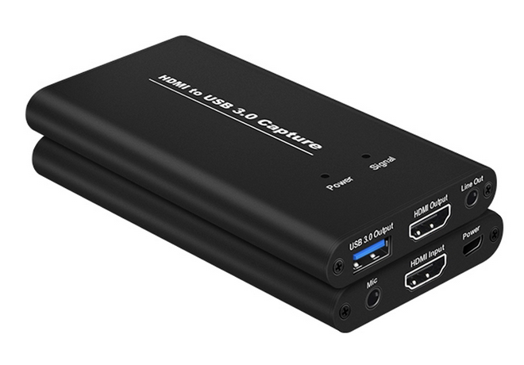
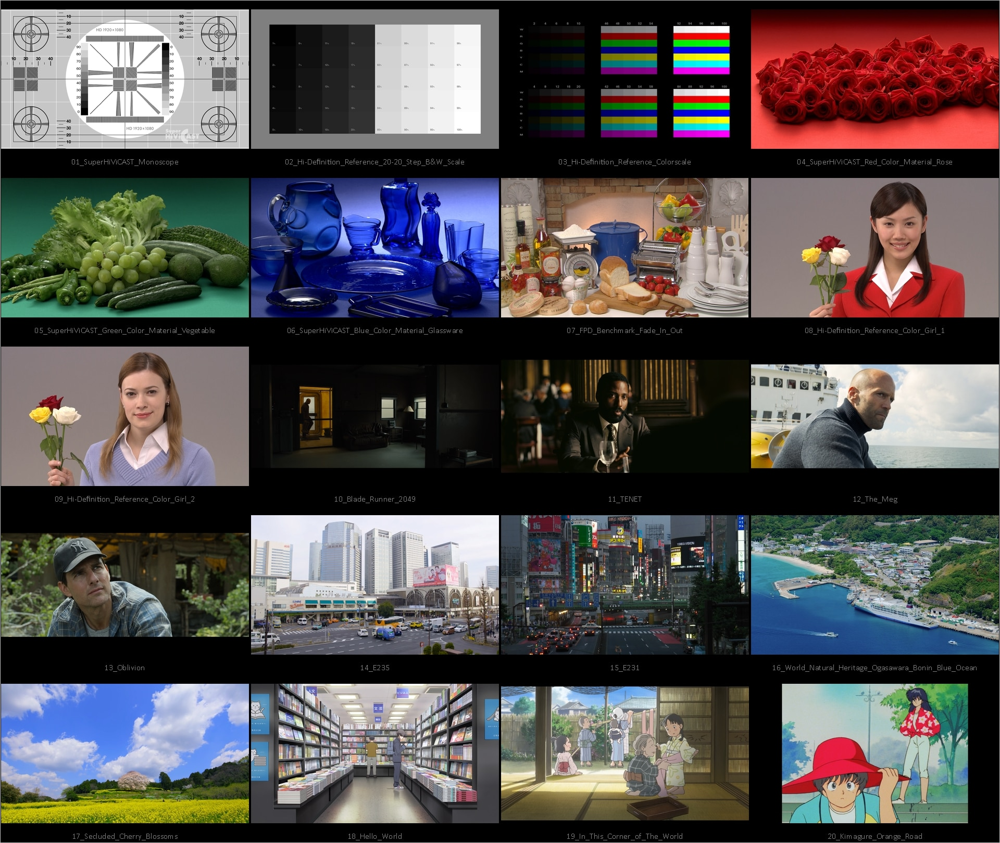

# HDMI Capture Card Image Quality
HDMI Capture Card Image Quality

- ความเป็นมาและวัตถุประสงค์
- ความรู้เบื้องต้น
  - Image quality
  - Colorspace
  - Chroma subsampling
  - Pixel format
  - Scaler
  - Splitter
  - Extractor
  - USB 3.0 / 3.1 / 3.2 ?
  - USB Vendor ID and Product ID
  - Uncompressed video data rates
- อุปกรณ์และโปรแกรมที่ใช้ทดสอบ
  - อุปกรณ์
  - โปรแกรม
- การทดสอบ
  - Latency test
  - Framerate test
    - Data rate checking
  - Image test
  - Temperatute test
  - Reliability test
- สรุปการทดสอบ
  - การเลือกใช้งาน
- ข้อมูลอ้างอิง

## ความเป็นมาและวัตถุประสงค์

## ความรู้เบื้องต้น

### Image quality

#### Subjective method

Double stimulus

##### NVIDIA ICAT

#### Objective method

 - SSIM
 - HCL: Luminance
 - HCL: Chroma

##### ImageMagick

### Colorspace

 - RGB (Red, Green, Blue)
 - HCL (Hue, Chroma, Luminance)

### Chroma subsampling

 - 4:4:4
 - 4:2:2
 - 4:2:0

### Pixel format

 - MJPEG (4:2:0)
 - NV12 (4:2:0)
 - YUYV422 (4:2:2)

### Scaler

### Splitter

HDMI video splitter

### Extractor

HDMI audio extractor

### USB 3.0 / 3.1 / 3.2 ?

|ชื่อปัจจุบัน|ชื่อก่อนหน้า (ชื่อแรกสุด)|เลนคู่|ความเร็ว (Gbps)|การเชื่อมต่อ|
|---|---|:---:|:---:|---|
|USB 3.2 Gen 1x1|USB 3.1 Gen 1 (USB 3.0)|:x:|5|USB-A, B, micro B, USB-C|
|USB 3.2 Gen 2x1|USB 3.1 Gen 2 (USB 3.1)|:x:|10|USB-A, B, micro B, USB-C|
|USB 3.2 Gen 1x2|(USB 3.2)|:heavy_check_mark:|10|USB-C|
|USB 3.2 Gen 2x2|(USB 3.2)|:heavy_check_mark:|20|USB-C|

### USB Vendor ID and Product ID

USB Vendor ID and Product ID

### Uncompressed video data rates

 - Data rates = [resolution](https://en.wikipedia.org/wiki/Display_resolution) × [color depth](https://en.wikipedia.org/wiki/Color_depth) × [frames per second](https://en.wikipedia.org/wiki/Frame_rate)
   - [Resolution](https://en.wikipedia.org/wiki/Display_resolution) = width × height
   - [Color depth](https://en.wikipedia.org/wiki/Color_depth) = bits per channel × [color channels](https://en.wikipedia.org/wiki/Channel_(digital_image)) × chroma ratio
     - Chroma ratio = (chroma subsampling Y + chroma subsampling Cb + chroma subsampling Cr) / 12
 - Integer Overflow/Wraparound

## อุปกรณ์และโปรแกรมที่ใช้ทดสอบ

### HDMI capture card

  - [ACASIS 4K HDMI Video Capture Card - HD33](https://www.acasis.com/collections/acasis-capture-card/products/acasis-4k-type-c-to-hdmi-compatible-video-capture-card-1080p-game-capture-card-recorder-box-device-for-live-streaming)
  - [ACASIS 2 Channel SDI/HDMI HD Video Capture Card - AC-U3SDH](https://www.acasis.com/collections/acasis-capture-card/products/acasis-2-channel-sdi-hdmi-compatible-hd-video-capture-card-usb3-0-1920-1080p-for-game-record-live-stream-for-ps4-xbox-one-switch)
  - [Apogee HDMI Capture USB 3.0 - HV-HCA12](https://www.digital2home.com/apogee-hdmi-capture-usb-3.0-hv-hca12)
  - [AVerMedia Live Streamer CAP 4K - BU113](https://www.avermedia.com/en/product-detail/bu113)
  - [ezcap CAM LINK 4K - ezcap331](https://www.ezcap.com/index.php/product/ezcap331camlink4k.html)
  - [HAGiBiS Video Capture Card - THB01](http://www.hagibis.com.cn/video-capture-card-p00193p1.html)
  - [Rullz HDMI Video Capture 4K 30Hz U3 - MS2130](https://www.aliexpress.com/i/1005004883158574.html)

|&nbsp;|ACASIS HD33|ACASIS U3SDH|Apogee HV-HCA12|AVerMedia BU113|ezcap ezcap331|HAGiBiS THB01|Rullz 4K U3 30Hz|
|---|---|---|---|---|---|---|---|
|Interface|USB 2.0|USB 3.2 Gen 1|USB 3.2 Gen 1|USB 3.2 Gen 1|USB 3.2 Gen 1|USB 2.0|USB 3.2 Gen 1|
|Interface Type|USB-C female|USB-B female|USB-A female|USB-C female|USB-A male|USB-C female|USB-A male|
|Input|HDMI 1.4b|HDMI 1.4|HDMI 1.3a|HDMI 2.0|HDMI 1.4b|HDMI 1.4b|HDMI 1.4b|
|Digital Video to USB Bridge IC|[MacroSilicon MS2109](http://en.macrosilicon.com/info.asp?base_id=2&third_id=50)|[Lattice ECP3-17](https://www.latticesemi.com/en/Products/FPGAandCPLD/LatticeECP3)|[EtronTech EJ511](https://www.eevertech.com/product_d.php?lang=en&tb=1&id=1045)|[iTE IT9325TE](https://www.iTE.com.tw/en/product/view?mid=160)|[iTE IT9323TE](https://www.iTE.com.tw/en/product/view?mid=160)|[MacroSilicon MS2109](http://en.macrosilicon.com/info.asp?base_id=2&third_id=50)|[MacroSilicon MS2130](http://www.ultrasemi.com/index.php/td-3-48-72-446)|

#### ACASIS 4K HDMI Video Capture Card - HD33

  - Interface
    - USB: USB 2.0 Type-C female
    - HDMI: HDMI 1.4b female
  - Streaming & Recording Resolutions:
    - USB 2.0

      ||MJPEG (SDR)|NV12 (SDR)|YUY2 (SDR)|RGB32 (SDR)|P010 (HDR)|
      |:---:|:---:|:---:|:---:|:---:|:---:|
      |**1920 × 1080**|60|-|5|-|-|
      |**1600 × 1200**|60|-|5|-|-|
      |**1360 × 768**|60|-|8|-|-|
      |**1280 × 1024**|60|-|8|-|-|
      |**1280 × 960**|60|-|8|-|-|
      |**1280 × 720**|60|-|10|-|-|
      |**1024 × 768**|60|-|10|-|-|
      |**800 × 600**|60|-|20|-|-|
      |**720 × 576**|60|-|25|-|-|
      |**720 × 480**|60|-|30|-|-|
      |**640 × 480**|60|-|30|-|-|
 - Digital Video to USB Bridge IC: [MacroSilicon MS2109](http://en.macrosilicon.com/info.asp?base_id=2&third_id=50)
 - USB
   - Vendor ID: 0x534D (Hefei Macrosilicon Technology Co., Ltd. - OBSOLETE)
   - Product ID: 0x2109
 - HDMI passthrough
 - Line-in
 - ODM/OEM
   - [PURPLELEC 720P/1080P HDMI Loop Out HD External Video Capture Equipment - PEC-HD33](https://www.purplelec.com/products/720p-1080p-hdmi-loop-out-hd-external-video-capture-equipment)
 - Firmware Update
   - [PURPLELEC DOWNLOAD - (PEC-HD31,PEC-HD33) USB 1080P Capture Card Chip Update [Win]](https://www.purplelec.com/downloads/)

#### ACASIS 2 Channel SDI/HDMI HD Video Capture Card - AC-U3SDH

  - Interface
    - USB: USB 3.2 Gen 1x1 Type-B female
    - HDMI: HDMI 1.4 female
  - Streaming & Recording Resolutions:
    - USB 3.0
    - USB 2.0
  - UVA & UVC
  - Digital Video to USB Bridge IC: [Lattice ECP3-17 FPGA](https://www.latticesemi.com/en/Products/FPGAandCPLD/LatticeECP3)
  - ODM/OEM
    - [PURPLELEC SDI & HDMI Input 1080P/1080i FHD External Video Capture Equipment - PEC-U3HDS](https://www.purplelec.com/products/makeup-modern-dresser-wood-dresser-with-mirror-51)
    - [TYSTVideo 2 Channel SDI+HDMI Video Capture Box - TY-U3SDH](http://www.tystvideo.com/en/product_detail/172/419.html)

#### Apogee HDMI Capture USB 3.0 - HV-HCA12

 - USB 3.2 Gen 1x1
 - Digital Video to USB Bridge IC: [EtronTech EJ511](https://www.eevertech.com/product_d.php?lang=en&tb=1&id=1045)
 - HDMI passthrough
 - Line-out
 - ODM/OEM
   - [CreHiVi HV-HCA12](http://www.hi-video.com.cn/Crehivi/pro/Video_Capture/2018/0910/119.html)
 - รีวิวชิป EtronTech EJ511
   - [Razer Ripsaw HD Review](https://www.weistang.com/thread-115925-1-1.html)
   - [Rullz USB 3.0 Navy U3 HDMI Capture Card](https://blog.sreb.me/2021/03/03/rullz-navy-u3-review/)
   - [USB-Capture-Card-Reversing](https://github.com/ArsenioDev/USB-Capture-Card-Reversing)

#### AVerMedia Live Streamer CAP 4K - BU113

  - Interface
    - USB: USB 3.2 Gen 1x1 Type-C female
    - HDMI: HDMI 2.0 female
  - Streaming & Recording Resolutions:
    - USB 3.0
      
      ||MJPEG (SDR)|NV12 (SDR)|YUY2 (SDR)|RGB32 (SDR)|P010 (HDR)|
      |:---:|:---:|:---:|:---:|:---:|:---:|
      |**3840 × 2160**|-|30|-|-|-|
      |**2560 × 1440**|-|60|60|-|-|
      |**1920 × 1080**|-|60|60|-|60|
      |**1280 × 720**|-|60|60|-|60|
      |**720 × 576**|-|50|50|-|-|
      |**720 × 480**|-|60|60|-|-|
      |**640 × 480**|-|60|60|-|-|
    - USB 2.0
      
      ||MJPEG (SDR)|NV12 (SDR)|YUY2 (SDR)|RGB32 (SDR)|P010 (HDR)|
      |:---:|:---:|:---:|:---:|:---:|:---:|
      |**1280 × 720**|-|30|30|-|-|
      |**720 × 576**|-|50|50|-|-|
      |**720 × 480**|-|60|60|-|-|
      |**640 × 480**|-|60|60|-|-|
  - Audio: HDMI stereo 16bit 48KHz
  - Scaling: Hardware downscaling and upscaling to 1080p
  - Digital Video to USB Bridge IC: [iTE Tech IT9325TE Digital Video to USB3 Converter](https://www.iTE.com.tw/en/product/view?mid=160) เครดิตรูปจาก [에버미디어 LIVE STREAMER CAP 4K : 고퀄리티 스트리밍을 원한다면](https://coolenjoy.net/bbs/review/901544)
    
    
  - USB
    - Vendor ID: 0x07CA (AVerMedia Technologies, Inc.)
    - Product ID: 0x1113
  - รีวิว
    - [AVerMedia Live Streamer CAP 4K Review (BU113) – So Much More Than a Cam Link!](https://streamguides.gg/2021/10/avermedia-live-streamer-cap-4k-review-bu113-so-much-more-than-a-cam-link/)
    - [에버미디어 LIVE STREAMER CAP 4K : 고퀄리티 스트리밍을 원한다면](https://coolenjoy.net/bbs/review/901544)

#### ezcap CAM LINK 4K - ezcap331

  - Interface
    - USB: USB 3.2 Gen 1x1 Type-C female
    - HDMI: HDMI 1.4b male
  - Streaming & Recording Resolutions:
    - USB 3.0
      
      ||MJPEG (SDR)|NV12 (SDR)|YUY2 (SDR)|RGB32 (SDR)|P010 (HDR)|
      |:---:|:---:|:---:|:---:|:---:|:---:|
      |**3840 × 2160**|-|30|-|-|-|
      |**2560 × 1440**|-|60|50|-|-|
      |**1920 × 1080**|-|120|60|30|-|
      |**1280 × 720**|-|60|60|60|-|
    - USB 2.0
      
      ||MJPEG (SDR)|NV12 (SDR)|YUY2 (SDR)|RGB32 (SDR)|P010 (HDR)|
      |:---:|:---:|:---:|:---:|:---:|:---:|
      |**1280 × 720**|-|30|30|-|-|
      |**720 × 576**|-|50|50|-|-|
      |**720 × 480**|-|60|60|-|-|
      |**640 × 480**|-|60|60|-|-|
  - Digital Video to USB Bridge IC: [iTE Tech IT9323TE Digital Video to USB3 Converter](https://www.iTE.com.tw/en/product/view?mid=160) คาดเดาจากการตรวจสอบดังนี้
      - [Custom Resolution Utility (CRU)](https://www.monitortests.com/forum/Thread-Custom-Resolution-Utility-CRU) แจ้งว่าเป็นชิป iTE Tech ในชีรีส์ IT9320

        
      - ตรวจสอบไฟล์ firmware ด้วยโปรแกรม [ImHex](https://imhex.werwolv.net/) พบว่าเป็นไฟล์ firmware สำหรับ iTE Tech

        
      - ตรวจภาพชิปโดยนับจำนวนขาชิป เครดิตรูปจาก [EZCap GameDock Ultra Review](https://cultists.network/9532/ezcap-gamedock-ultra-review/)

        
  - USB
    - Vendor ID: 0x32ED (Shenzhen Forwardvideo Technology Co., Ltd.)
    - Product ID: 0x3200
  - ODM/OEM
    - [GERA SOLO](https://gera.ltd/gera-solo-pocket-4k-hdmi-to-usb3-1-capture-card/)
    - [Pyle PLINK2](https://www.pyleaudio.com/sku/PLINK2/Camera-Link-4K-USB31-GEN-HDMI-Video-Capture-Device---Live-Streaming-Record-Capture,-USB-31-GEN1-Video-Recording)
  - รีวิว
    - [Ezcap 331 short review & some info about HyperHDR](https://www.hyperhdr.eu/2022/01/ezcap-331-short-review-some-info-about.html)
  - Firmware Update
    - [ezcap Support-Downloads & Documentation - ezcap331](https://www.ezcap.com/index.php/support/download.html)

#### HAGiBiS Video Capture Card - THB01

  - Interface
    - USB: USB 2.0 Type-C female
    - HDMI: HDMI 1.4b female
  - Streaming & Recording Resolutions:
    - USB 2.0

      ||MJPEG (SDR)|NV12 (SDR)|YUY2 (SDR)|RGB32 (SDR)|P010 (HDR)|
      |:---:|:---:|:---:|:---:|:---:|:---:|
      |**1920 × 1080**|60|-|5|-|-|
      |**1600 × 1200**|60|-|5|-|-|
      |**1360 × 768**|60|-|8|-|-|
      |**1280 × 1024**|60|-|8|-|-|
      |**1280 × 960**|60|-|8|-|-|
      |**1280 × 720**|60|-|10|-|-|
      |**1024 × 768**|60|-|10|-|-|
      |**800 × 600**|60|-|20|-|-|
      |**720 × 576**|60|-|25|-|-|
      |**720 × 480**|60|-|30|-|-|
      |**640 × 480**|60|-|30|-|-|
  - Digital Video to USB Bridge IC: [MacroSilicon MS2109](http://en.macrosilicon.com/info.asp?base_id=2&third_id=50)
 - USB
   - Vendor ID: 0x534D (Hefei Macrosilicon Technology Co., Ltd. - OBSOLETE)
   - Product ID: 0x2109
  - HDMI passthrough
  - Line-out
  - Firmware Update
    - [PURPLELEC DOWNLOAD - (PEC-HD31,PEC-HD33) USB 1080P Capture Card Chip Update [Win]](https://www.purplelec.com/downloads/)

#### Rullz HDMI Video Capture 4K 30Hz U3 MS2130
 
 
 
  - USB 3.2 Gen 1x1
  - Digital Video to USB Bridge IC: [MacroSilicon MS2130](http://www.ultrasemi.com/index.php/td-3-48-72-446)
  - USB
    - Vendor ID: 0x345F (MacroSilicon Technology Co., Ltd.)
    - Product ID: 0x2130
  - YUY2 1920x1080@60fps
  - MJPEG 1290x1080@60fps
  - Firmware Update:
    - [UltraSemi MS2130 MS2131 Reference Design](https://github.com/ultrasemier/ms213x_community)
    - [Macrosilicon MS2106/MS2109/MS2130 research](https://github.com/BertoldVdb/ms-tools)

### อุปกรณ์อื่น ๆ

  - [UGREEN HDMI splitter 1x2](https://www.amazon.com/dp/B0B129NNV1 )
  - [Infiray T2L USB-C thermal camera](https://www.infiray.com/products/t2s-t2l-thermal-camera-for-smartphone.html)

### แผ่น Blu-ray

  - [Super HiVi CAST](https://web.archive.org/web/20200215085853/http://www.hivicast.jp/detail/shvc_00_en.html)
  - [FPD Benchmark Software](https://www.phileweb.com/editor/av-review/157/special.html)
  - [Hi-Definition Reference Software](https://www.qtec.ne.jp/technology/hdrs/)
  - [Blade Runner 2049](https://www.amazon.com//dp/B07VFN6WLH/)
  - [TENET](https://www.amazon.com/dp/B08MHRRKW7/)
  - [The Meg](https://www.amazon.com/dp/B07D512BDG/)
  - [Oblivion](https://www.amazon.com/dp/B07KLCVVV9/)
  - [E235系山手線 4K撮影作品【ブルーレイ】](http://vicom.jp/shopdetail/000000001360)
  - [Train Night View 夜の山手線 4K撮影作品【ブルーレイ】](http://vicom.jp/shopdetail/000000001361)
  - [世界自然遺産 小笠原 ～ボニンブルーの海～【ブルーレイ】](http://vicom.jp/shopdetail/000000001359/)
  - [さくら 春を彩る華やかな桜のある風景 4K撮影作品【ブルーレイ】](http://vicom.jp/shopdetail/000000001342/)
  - [Hello World](https://www.amazon.com/dp/B083WCFCHV/)
  - [In This Corner of The World](https://www.amazon.com/dp/B072ZDZYKM/)
  - [Kimagure Orange Road](https://www.discotekmedia.com/Kimagure-Orange-Road-Complete-Blu-ray.htm)

### โปรแกรม

  - [mpv](https://mpv.io/) + [mpv-settings](https://github.com/Tsubajashi/mpv-settings)
  - [FFmpeg](https://ffmpeg.org/)
  - [HyperHDR](https://github.com/awawa-dev/HyperHDR)
  - [PotPlayer](https://potplayer.daum.net/)
  - [trdrop](https://github.com/cirquit/trdrop)
  - [ImageMagick](https://www.imagemagick.org/)
  - [mono-to-stereo](https://github.com/ToadKing/mono-to-stereo), [mono-to-stereo-gui](https://github.com/ndekopon/mono-to-stereo-gui)
  - [NVIDIA Image Comparison & Analysis Tool (ICAT)](https://www.nvidia.com/en-us/geforce/technologies/icat/)
  - [Custom Resolution Utility (CRU)](https://www.monitortests.com/forum/Thread-Custom-Resolution-Utility-CRU)
  - [GhostBuster](https://github.com/SPOOCQ/ghostbuster)
  - [USB Device Tree Viewer](https://www.uwe-sieber.de/usbtreeview_e.html)
  - [Device Cleanup Cmd](https://www.uwe-sieber.de/misc_tools_e.html)
  - [ImHex](https://imhex.werwolv.net/)

## การทดสอบ

### Latency test

#### Video latency test

HyperHDR

#### Audio latency test

TBD

### Framerate test

  - PotPlayer
  - trdrop

#### Data rate checking

### Image test

  - Objective test
    - Similarity

      |SSIM|MOS|คุณภาพ (Quality)|
      |---|---|---|
      |≥0.99|5|ยอดเยี่ยม (Excellent)|
      |≥0.95 & <0.99|4|ดี (Good)|
      |≥0.88 & <0.95|3|พอใช้ (Fair)|
      |≥0.50 & <0.88|2|ไม่ดี (Poor)|
      |<0.50|1|แย่ (Bad)|

      MOS = [Mean opinion score](https://en.wikipedia.org/wiki/Mean_opinion_score)

    - Exposure
  - Subjective test
    - NVIDIA ICAT

### Temperatute test

  - Operating temperature
  - Infiray T2L test

### Reliability test

interval capture test with ffmpeg

## สรุปการทดสอบ

 - การเลือก HDMI capture card
   - MS2109 สำหรับหัดเริ่ม recording/streaming ในราคาเบาๆ
     - ACASIS HD33
     - HAGiBiS THB01
   - MS2130 ที่สามารถบันทึก 1080p60 ได้จริง แต่คุณภาพของภาพด้อยกว่า MS2109 เล็กน้อย
     - Rullz 4K 30Hz U3
   - iTE IT9320 Digital Video to USB3 Converter กับคุณภาพของภาพที่ดีที่สุด
     - iTE IT9323TE 
       - ezcap ezcap331 ราคาพันกว่าบาท
       - EVGA XR1 lite
         - รีวิว
           - [EVGA XR1 Lite Review – Setting A New Standard](https://cultists.network/4859/evga-xr1-lite/)
           - [EVGA XR1 lite: Affordable 1080p60 HDMI Capture Card For Linux](https://linuxgamecast.com/2021/09/evga-xr1-lite-60-1080p60-hdmi-capture-card-for-linux/)
     - iTE IT9325TE
       - AVerMedia BU113
       - [ASUS TUF GAMING CAPTURE BOX - CU4K30](https://www.asus.com/accessories/streaming-kits/video-capture-streaming/tuf-gaming-capture-box-cu4k30/)
         - รีวิว [华硕CAPTURE BOX-CU4K30视频采集盒评测](https://www.gushiciku.cn/dl/1pO0M/)
       - [NZXT Signal 4K30](https://nzxt.com/product/signal-4k30)
         - รีวิว [QUASAR ZONE: NZXT Signal 4K30 캡처카드](https://quasarzone.com/bbs/qc_qsz/views/1362936)
       - ASUS TUF GAMING CAPTURE BOX - CU4K30 กับ NZXT Signal 4K30 มี PCB layout, ชิปต่าง ๆ รวมถึงรูปแบบสติ๊กเกอร์บน PCB คล้ายกันมาก จนอดคิดไม่ได้ว่ามาจากโรงงานเดียวกัน
         - ASUS CU4K30 เปิดตัวต้นปี [2021](https://edgeup.asus.com/2021/tuf-gaming-capture-box-cu4k30/) / NXZT 4K30 เปิดตัวกลางปี [2022](https://twitter.com/nzxt/status/1541802049632878592)
         - Made in Taiwan
         - iTE [IT68051TE](https://www.ite.com.tw/en/product/view?mid=102) (ASUS) / IT68050TE (NZXT) HDMI Receiver
         - iTE [IT9325TE](https://www.ite.com.tw/en/product/view?mid=160) Digital Video to USB3 Converter
         - iTE [IT6663FN](https://www.ite.com.tw/en/product/view?mid=104) 1-to-2 HDMI2.0/MHL Dual in Active Splitter with EDID RAM
         - EtronTech EJ179W USB 3.0 Host Controller
         - [MindMotion MM32L073 ARM Cortex-M0 48 MHz MCU](https://www.mindmotion.com.cn/products/mm32mcu/mm32l/mm32l_others/mm32l0xxn/)
         - รหัส MCU ที่อยู่บนสติ๊กเกอร์ barcode [:floppy_disk: HU3902](https://dlcdnets.asus.com/pub/ASUS/Graphic%20Card/Accessory/TUF_GAMING_CAPTURE_BOX-CU4K30/ASUS_FWUpd_1.11_7_M0_061D00_Hex_1480_LocalPack.zip) (ASUS) / HU3906 (NZXT)
         - PCB
           - PCB ASUS TUF GAMING CAPTURE BOX - CU4K30 เครดิตรูปจาก [华硕CAPTURE BOX-CU4K30视频采集盒评测](https://www.gushiciku.cn/dl/1pO0M/)

             
           - PCB NZXT Signal 4K30 เครดิตรูปจาก [QUASAR ZONE: NZXT Signal 4K30 캡처카드](https://quasarzone.com/bbs/qc_qsz/views/1362936)

             
   - ACASIS U3SDH สำหรับงาน broadcasting วัดุทนทาน

## ข้อมูลอ้างอิง
 - [USB 3.0](https://en.wikipedia.org/wiki/USB_3.0)
 - [New FAQ on USB Vendor ID and Product ID – Open Source Hardware Association](https://www.oshwa.org/2013/11/19/new-faq-on-usb-vendor-id-and-product-id/)
 - [A Novel Methodology for Mapping Objective Video Quality Metrics to the Subjective MOS Scale](https://ieeexplore.ieee.org/abstract/document/6873572/)
 - [NON-EXPERTS OR EXPERTS? STATISTICAL ANALYSES OF MOS USING DSIS METHOD](https://repositori.upf.edu/bitstream/handle/10230/45507/sugito_icassp_nonex.pdf?sequence=1&isAllowed=y)
